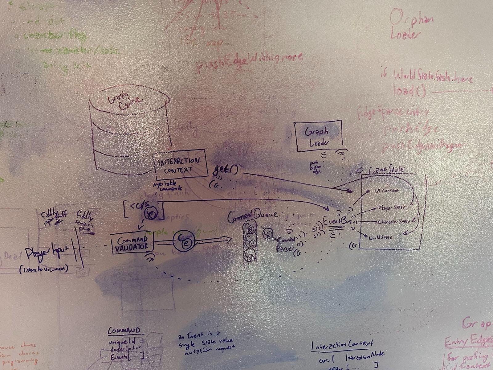

# how it works

## interaction context

a description of the modules coordinating the core gameplay loop

<!-- TODO describe what the heck this is -->

## story as graph

a description of how the game treats player actions and world events as a
malleable graph

<!-- TODO describe what the hell this is -->